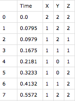

PyCTBN
======

A Continuous Time Bayesian Networks Library

Installation/Usage
*******************
Download the release in .tar.gz or .whl format and simply use pip install to install it::

    $ pip install PyCTBN-1.0.tar.gz
    
Coverage
********
Please refer to https://app.codecov.io/gh/philipMartini/PyCTBN for a detailed report of test coverage.

Documentation
*************
Please refer to https://github.com/madlabunimib/PyCTBN/ for the full project documentation.

Implementing your own data importer
***********************************
| This example demonstrates the implementation of a simple data importer the extends the class AbstractImporter 
| to import data in csv format. The net in exam has three ternary nodes and no prior net structure.
| Suppose the trajectories that have to be inported have this structure:

 
| In the read_csv_file method the data are imported in memory, put in a list and  assigned to the _df_samples_list class
| member, so that it contains all the trajectories to be processed.
| In the import_variables method the dataframe containing the nodes labels and the cardinalities of the nodes 
| is assigned to the _df_variables class member. 
| The class member _sorter has to contain the nodes labels in the same order of the trajectory columns,
| just override the build_sorter method to do that.
| If your datasets names have particular id, you can keep it using the dataset_id method to assign the id to a new class member. 
| Finally the import_data method call all the previously implemented methods and calls the compute_row_delta_in_all_samples_frames
| to process all the trajectories in _df_samples_list.
| For more information about the class memebers and methods of AbstractImporter please refer to the documentation.

.. code-block:: python

    import pandas as pd
    import typing
    
    from PyCTBN import AbstractImporter
    from PyCTBN import SamplePath

    class CSVImporter(AbstractImporter):

        def __init__(self, file_path):
            self._df_samples_list = None
            super(CSVImporter, self).__init__(file_path)

        def import_data(self):
            self.read_csv_file()
            self._sorter = self.build_sorter(self._df_samples_list[0])
            self.import_variables()
            self.compute_row_delta_in_all_samples_frames(self._df_samples_list)

        def read_csv_file(self):
            df = pd.read_csv(self._file_path)
            df.drop(df.columns[[0]], axis=1, inplace=True)
            self._df_samples_list = [df]

        def import_variables(self):
            values_list = [3 for var in self._sorter]
            # initialize dict of lists
            data = {'Name':self._sorter, 'Value':values_list}
            # Create the pandas DataFrame
            self._df_variables = pd.DataFrame(data)

        def build_sorter(self, sample_frame: pd.DataFrame) -> typing.List:
            return list(sample_frame.columns)[1:]

        def dataset_id(self) -> object:
            pass

    def main():
        # create the importer object
        csvimp = CSVImporter('/dataset_example.csv')
        # call the wrapping method that wil import and process the data
        csvimp.import_data()
        # pass the AbstractImporter object to the SamplePath constructor
        s1 = SamplePath(csvimp)
        # SamplePath will contain the Trajecotry object...
        s1.build_trajectories()
        #...and the Structure object with all the process data
        s1.build_structure()

Structure Estimation Examples
##############################

| In this section some examples will be shown in order to provide some useful information about the usage of the library

Constraint based estimation
****************************
| This example shows how to estimate the structure given a series of trajectories using a constraint based approach.
| The first three instructions import all the necessary data (trajectories, nodes cardinalities, nodes labels),
| and are contextual to the dataset that is been used, in the code comments are marked as optional <>.
| If your data has a different structure or format you should implement your own importer 
| (see Implementing your own importer example).
| The other instructions are not optional and should follow the same order.
| A SamplePath object is been created, passing an AbstractImporter object that contains the  correct class members 
| filled with the data that are necessary to estimate the structure.
| Next the build_trajectories  and build_structure methods are called to instantiate the objects that will contain
| the processed trajectories and all the net information.
| Then an estimator object is created, in this case a constraint based estimator, 
| it necessary to pass a SamplePath object where build_trajectories and build_structure methods have already been called.
| If you have prior knowledge about the net structure pass it to the constructor with the known_edges parameter.
| The other three parameters are contextual to the StructureConstraintBasedEstimator, see the documentation for more details.
| To estimate the structure simply call the estimate_structure method.
| You can obtain the estimated structure as a boolean adjacency matrix with the method adjacency_matrix, 
| or save it as a json file that contains all the nodes labels, and obviously the estimated edges.
| You can also save a graphical model representation of the estimated structure 
| with the save_plot_estimated_structure_graph.

.. code-block:: python

    import glob
    import os

    from PyCTBN import JsonImporter
    from PyCTBN import SamplePath
    from PyCTBN import StructureConstraintBasedEstimator

    def structure_constraint_based_estimation_example():
        # <read the json files in ./data path>
        read_files = glob.glob(os.path.join('./data', "*.json"))
        # <initialize a JsonImporter object for the first file>
        importer = JsonImporter(file_path=read_files[0], samples_label='samples',
                                structure_label='dyn.str', variables_label='variables',
                                time_key='Time', variables_key='Name')
        # <import the data at index 0 of the outer json array>
        importer.import_data(0)
        # construct a SamplePath Object passing a filled AbstractImporter object
        s1 = SamplePath(importer=importer)
        # build the trajectories
        s1.build_trajectories()
        # build the information about the net
        s1.build_structure()
        # construct a StructureEstimator object passing a correctly build SamplePath object
        # and the independence tests significance, if you have prior knowledge about 
        # the net structure create a list of tuples
        # that contains them and pass it as known_edges parameter
        se1 = StructureConstraintBasedEstimator(sample_path=s1, exp_test_alfa=0.1, chi_test_alfa=0.1,
                                                known_edges=[], thumb_threshold=25)
        # call the algorithm to estimate the structure
        se1.estimate_structure()
        # obtain the adjacency matrix of the estimated structure
        print(se1.adjacency_matrix())
        # save the estimated structure  to a json file 
        # (remember to specify the path AND the .json extension)....
        se1.save_results('./results0.json')
        # ...or save it also in a graphical model fashion 
        # (remember to specify the path AND the .png extension)
        se1.save_plot_estimated_structure_graph('./result0.png')

Score based estimation with Hill Climbing
*****************************************

| This example shows how to estimate the structure given a series of trajectories using a score based approach
| and the Hill Climbing algorithm as optimization strategy.
| The structure of the code is the same as the previus example, but an explanation of the Structure score based estimator 
| will be provided.
| Then an estimator object is created, in this case a score based estimator, 
| it necessary to pass a SamplePath object where build_trajectories and build_structure methods have already been called.
| If you have prior knowledge about the net structure pass it to the constructor with the known_edges parameter.
| The other parameters are contextual to the StructureScoreBasedEstimator, see the documentation for more details.
| To estimate the structure simply call the estimate_structure method passing the desidered parameters, such as the 
| optimization strategy, or simply use the default configuration. 
| In this case an Hill Climbing approch is choosen.

.. code-block:: python

    import glob
    import os

    from PyCTBN import JsonImporter
    from PyCTBN import SamplePath
    from PyCTBN import StructureScoreBasedEstimator

    def structure_constraint_based_estimation_example():
        # <read the json files in ./data path>
        read_files = glob.glob(os.path.join('./data', "*.json"))
        # <initialize a JsonImporter object for the first file>
        importer = JsonImporter(file_path=read_files[0], samples_label='samples',
                                structure_label='dyn.str', variables_label='variables',
                                time_key='Time', variables_key='Name')
        # <import the data at index 0 of the outer json array>
        importer.import_data(0)
        # construct a SamplePath Object passing a filled AbstractImporter object
        s1 = SamplePath(importer=importer)
        # build the trajectories
        s1.build_trajectories()
        # build the information about the net
        s1.build_structure()
        # construct a StructureEstimator object passing a correctly build SamplePath object
        # and hyperparameters tau and alpha, if you have prior knowledge about 
        # the net structure create a list of tuples
        # that contains them and pass it as known_edges parameter
        se1 = StructureScoreBasedEstimator(sample_path=s1, tau_xu = 0.1, alpha_xu = 1,
                                          known_edges=[])
        # call the algorithm to estimate the structure
        # and pass all the desidered parameters, in this case an Hill Climbing approach 
        # will be selected as optimization strategy. 
        se1.estimate_structure(
                            max_parents = None,
                            iterations_number = 40,
                            patience = None,
                            optimizer = 'hill'
                            )
        # obtain the adjacency matrix of the estimated structure
        print(se1.adjacency_matrix())
        # save the estimated structure  to a json file 
        # (remember to specify the path AND the .json extension)....
        se1.save_results('./results0.json')
        # ...or save it also in a graphical model fashion 
        # (remember to specify the path AND the .png extension)
        se1.save_plot_estimated_structure_graph('./result0.png')

Score based estimation with Tabu Search and Data Augmentation
**************************************************************

| This example shows how to estimate the structure given a series of trajectories using a score based approach
| and the Tabu Search algorithm as optimization strategy and how to use a data augmentation strategy to increase the 
| number of data available. 
| The structure of the code is the same as the previus example, but an explanation of the data augmentation technique
| will be provided.
| In this case a SampleImporter is used to import the data instead of a JsonImporter.
| Using a SampleImporter requires the user to read the data and put it into different lists or DataFrames before to 
| inizialize the SampleImporter instance.
| Then it is possible to increase the amount of data by using one of the external libraries who provide data augmentation 
| approaches, in this example sklearn is used.
| Then all the information can be passed to the SampleImporter constructor and the import_data method can be used to provide
| the preprossing operations of the PyCTBN library.
| Then an estimator object is created, in this case a score based estimator, 
| it necessary to pass a SamplePath object where build_trajectories and build_structure methods have already been called.
| If you have prior knowledge about the net structure pass it to the constructor with the known_edges parameter.
| The other parameters are contextual to the StructureScoreBasedEstimator, see the documentation for more details.
| To estimate the structure simply call the estimate_structure method passing the desidered parameters, such as the 
| optimization strategy, or simply use the default configuration. 
| In this case an Hill Climbing approch is choosen.

.. code-block:: python

    import glob
    import os

    from sklearn.utils import resample

    from PyCTBN import SampleImporter
    from PyCTBN import SamplePath
    from PyCTBN import StructureScoreBasedEstimator

    def structure_constraint_based_estimation_example():
        # <read the json files in ./data path>
        read_files = glob.glob(os.path.join('./data', "*.json"))

        # read the first file in the directory (or pass the file path)
        with open(file_path=read_files[0]) as f:
                    raw_data = json.load(f)

                    # read the variables information
                    variables= pd.DataFrame(raw_data[0]["variables"])

                    # read the prior information if they are given
                    prior_net_structure = pd.DataFrame(raw_data[0]["dyn.str"])

                    #read the samples
                    trajectory_list_raw= raw_data[0]["samples"]

                    #convert them in DataFrame
                    trajectory_list = [pd.DataFrame(sample) for sample in trajectory_list_raw]

                    # use an external library in order to provide the data augmentation operations, in this case
                    # sklearn.utils is used
                    augmented_trajectory_list = resample (trajectory_list, replace = True, n_samples = 300 )

        # <initialize a SampleImporter object using the data read before>
        importer = SampleImporter(
                                        trajectory_list = augmented_trajectory_list,
                                        variables=variables,
                                        prior_net_structure=prior_net_structure
                                    )

        # <import the data>
        importer.import_data()
        # construct a SamplePath Object passing a filled AbstractImporter object

        s1 = SamplePath(importer=importer)
        # build the trajectories
        s1.build_trajectories()
        # build the information about the net
        s1.build_structure()
        # construct a StructureEstimator object passing a correctly build SamplePath object
        # and hyperparameters tau and alpha, if you have prior knowledge about 
        # the net structure create a list of tuples
        # that contains them and pass it as known_edges parameter
        se1 = StructureScoreBasedEstimator(sample_path=s1, tau_xu = 0.1, alpha_xu = 1,
                                          known_edges=[])
        # call the algorithm to estimate the structure
        # and pass all the desidered parameters, in this case a Tabu Search approach 
        # will be selected as optimization strategy. It is possible to select the tabu list length and 
        # the tabu rules duration, and the other parameters as in the previus example. 
        se1.estimate_structure(
                            max_parents = None,
                            iterations_number = 100,
                            patience = 20,
                            optimizer = 'tabu',
                            tabu_length = 10,
                            tabu_rules_duration = 10
                            )
        # obtain the adjacency matrix of the estimated structure
        print(se1.adjacency_matrix())
        # save the estimated structure  to a json file 
        # (remember to specify the path AND the .json extension)....
        se1.save_results('./results0.json')
        # ...or save it also in a graphical model fashion 
        # (remember to specify the path AND the .png extension)
        se1.save_plot_estimated_structure_graph('./result0.png')
